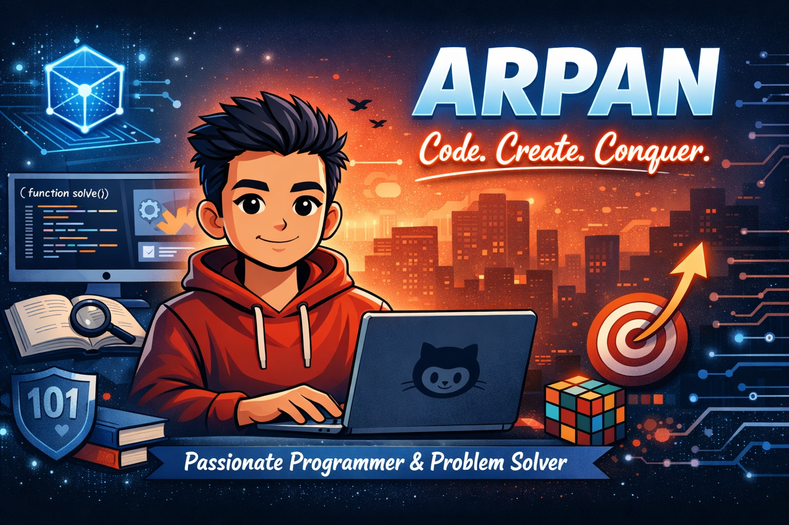

  

# 👋 Hi, I'm Arpan  

---

## 🚀 About Me
- 💻 Passionate about **Data Structures & Algorithms**, **Web Development**, and **Open Source**  
- 🎯 Focused on writing clean, efficient, and scalable code  
- 🌱 Currently exploring **System Design** and **Advanced DSA**  
- 🏆 Active problem solver on [LeetCode](https://leetcode.com/arpan0408/)  
- 📫 Reach me at: **your.email@example.com**

---

  

---

## 📊 GitHub Stats

  
  

---

## 🏆 LeetCode Stats

  

---

## 📂 Featured Projects
- 🔹 [DSA Repository](https://github.com/arpan0408/DSA) – My solutions to popular DSA problems  
- 🔹 [Snake Game](https://arpan0408.github.io/DSA/snake-game/) – A fun browser-based game hosted on GitHub Pages  
- 🔹 More projects coming soon...

---

## 🌐 Connect With Me

  
  
  

---

  <b>✨ “Code. Create. Conquer.” ✨</b> 
  <i>Passionate Programmer & Problem Solver</i>

